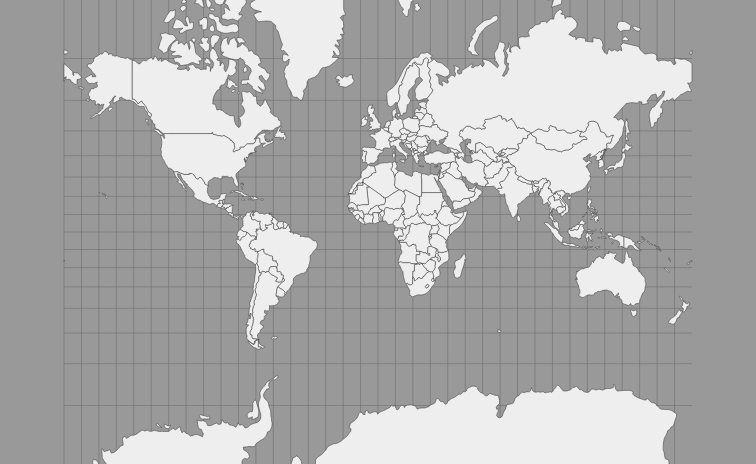
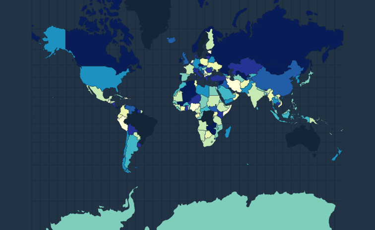
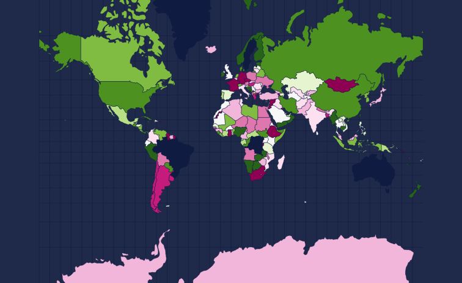

# `@nivo/geo`

## GeoMap

[documentation](http://nivo.rocks/geomap)

## GeoMapCanvas

[documentation](http://nivo.rocks/geomap/canvas)

## Choropleth

[documentation](http://nivo.rocks/choropleth)

## ChoroplethCanvas

[documentation](http://nivo.rocks/choropleth/canvas)

